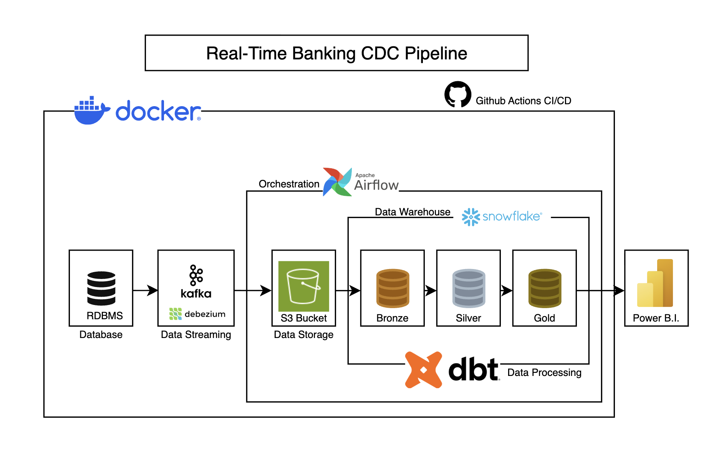
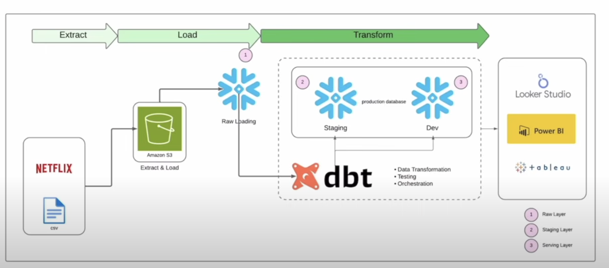
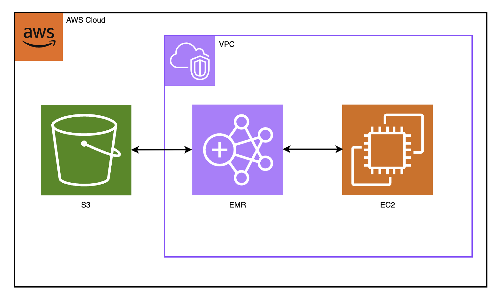
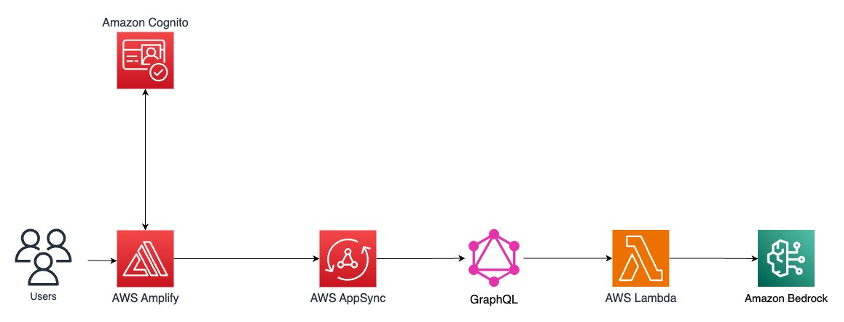
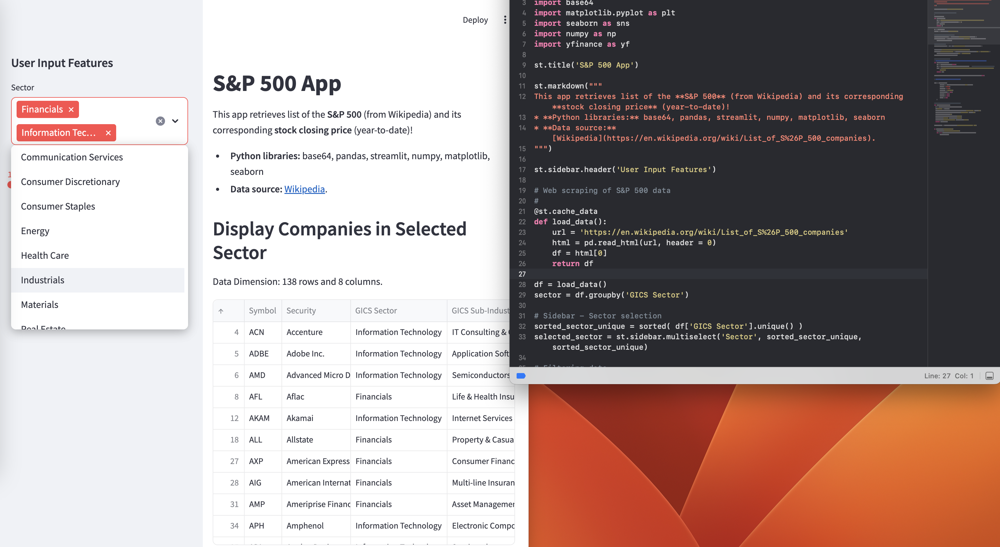
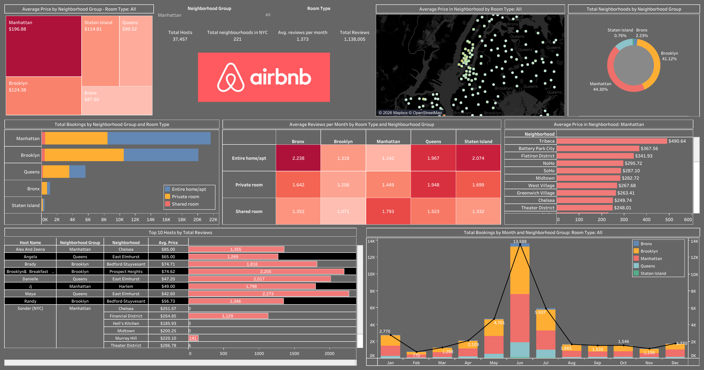
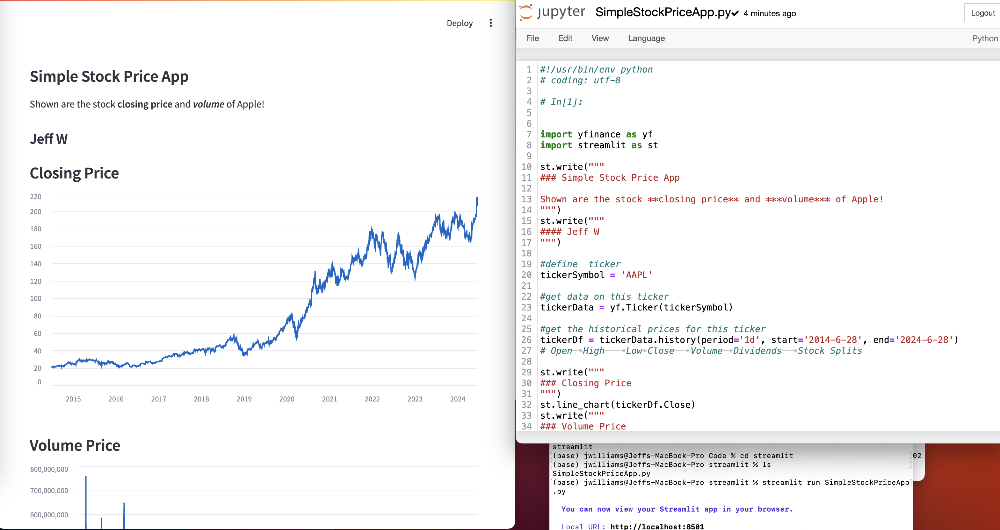
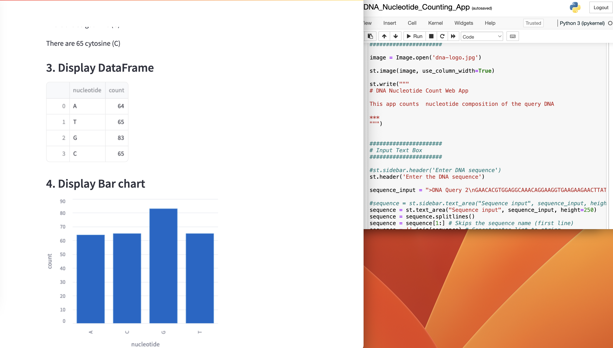

# Portfolio Projects

## Screenshots

  
  

  
  

  
  

  
  

---

## Welcome to my portfolio!

This repository contains a collection of projects. 

## Latest Projects...

- Banking CDC Pipeline with Modern Data Stack Kafka, Debezium, dbt, Snowflake, Airflow, PostgreSQL. Designed change data capture (CDC) architecture streaming PostgreSQL banking transactions (customers, accounts, transactions) via Kafka + Debezium into Snowflake. Built dbt transformation layer including SCD Type-2 snapshots for historical tracking, dimensional models (facts/dimensions), and automated CI/CD workflows with GitHub Actions.

-  Real-Time Stock Market Data Pipeline Kafka, dbt, Snowflake, Airflow, Python, Docker. Engineered end-to-end streaming pipeline capturing live stock data from Finnhub API via Kafka producers, landing raw events in MinIO (S3-compatible storage). Implemented medallion architecture (Bronze/Silver/Gold) with dbt transformations in Snowflake; orchestrated automated ingestion via Airflow DAGs and built Power BI dashboards for real- time analytics. 

- Modern ELT Pipeline with Medallion Architecture dbt, Snowflake, Apache Airflow, SQL. Architected production ELT pipeline implementing medallion architecture (Bronze/Silver/Gold) with dbt transformations orchestrated by Apache Airflow. Designed dimensional models (fact and star schema) with comprehensive data quality tests ensuring 99%+ accuracy.

- AWS EMR Big Data Processing Pipeline Apache Spark, PySpark, AWS EMR, S3. Built scalable distributed data processing system on AWS EMR handling large-scale financial datasets with PySpark. Optimized cluster configuration with spot instances, reducing AWS costs by 40% while processing 10GB+ daily transactions.

## Projects
- Stock Market Data Analysis with Python, SQL, Apache Kafka, AWS Glue, AWS Athena
- FRED (Federal Reserve Economic Data) Analysis: Showcasing capabilities of FRED api, with use of pandas, numpy and plotly for data visualization.
- Data Cleaning World Layoff Data in mySQL: Removing duplicates, Standardizing of dataset.
- BasicStockComparison: Showing basic yfinance capabilities/comparing META, TSLA and more to market benchmark. Numpy, Pandas, matplotlib, yfinance

## Completed Projects

- Stock Trading Analysis Project: A project that implements basic trading ideas. Matplotlib, pandas, yfinance.

- Amazon Web Scraper: A web scraping script to extract product data from Amazon. BeautifulSoup.

- Bike Sales Excel Dashboard: A dashboard built in Excel to analyze bike sales data and provide insights.

- Data Cleaning Project: Cleaning and preprocessing data of a Housing dataset. SQL

- Real Estate Proforma: A full proforma showcasing analysis of real estate investment property and generating projections for future performance. Excel

links to documentation: 
- https://github.com/JeffWilliams2/fed_speech_recognition
- https://github.com/JeffWilliams2/medallion-elt-pipeline
- https://github.com/JeffWilliams2/etl_airflow_dag
- https://github.com/JeffWilliams2/netflix-dbt-snowflake
- https://github.com/JeffWilliams2/aws-emr-spark-demo
- https://github.com/JeffWilliams2/film-elt-project-dbt
- https://github.com/JeffWilliams2/travel-destination-generator
- https://github.com/JeffWilliams2/crud-app-backend
- https://github.com/JeffWilliams2/NYC_Airbnb

